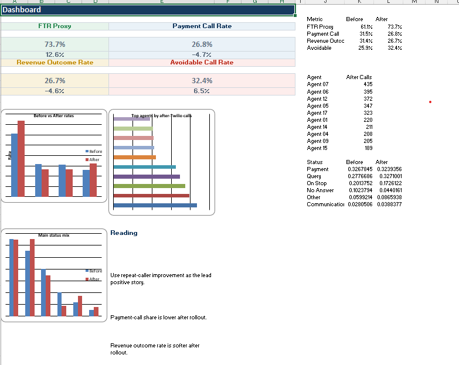

 Hi, I'm Seun Oseola 👋

Data Analyst | Python, SQL & Power BI | Turning Data into Operational Insights

I am a data analyst with a background in business process analysis and credit control operations. My work focuses on using data to improve operational efficiency, support performance monitoring, and generate actionable business insights.

---

## Featured Projects

### Predicting Demand for Perishable Goods
Python project analysing historical sales data to forecast demand for perishable products.

**Tools used:**
- Python
- Pandas
- NumPy
- Exploratory Data Analysis
- Forecasting

**Repository**  
https://github.com/Busayosage/predicting_demand_for_perishable_goods

---

### E-commerce Customer Cohort Analysis
Customer retention analysis using cohort techniques to measure engagement and repeat purchase behaviour.

**Key analysis areas:**
- Customer retention trends
- Customer lifecycle analysis
- Repeat purchase behaviour
- Cohort-based engagement tracking

**Tools used:**
- Python
- Pandas
- Data visualisation
- Cohort analysis

**Repository**  
https://github.com/Busayosage/ecommerce-cohort-analysis

---

### Twilio Operational Impact Analysis
Business analytics project analysing the operational impact of Twilio communication technology on credit control operations.

**Key insights:**
- Reduction in payment calls
- Revenue-generating outcomes
- Operational time savings
- Agent workload analysis

**Tools used:**
- Microsoft Excel
- Pivot Tables
- KPI analysis
- Operational dashboards

**Repository**  
https://github.com/Busayosage/Twilio_introduction_impact_on_business_operations

---

## Project Visuals

### Twilio Operational Dashboard

Example operational dashboard analysing call outcomes, revenue indicators, and workload distribution after introducing Twilio communication technology.

---

## Skills

- Data Analysis
- Business Analytics
- Excel Dashboards
- Python (Pandas, EDA)
- SQL
- Operational KPI Analysis
- Data Visualisation

---

## Connect With Me

**LinkedIn**  
https://www.linkedin.com/in/oseola-oluwaseun-a5a77a128/

**GitHub**  
https://github.com/Busayosage
